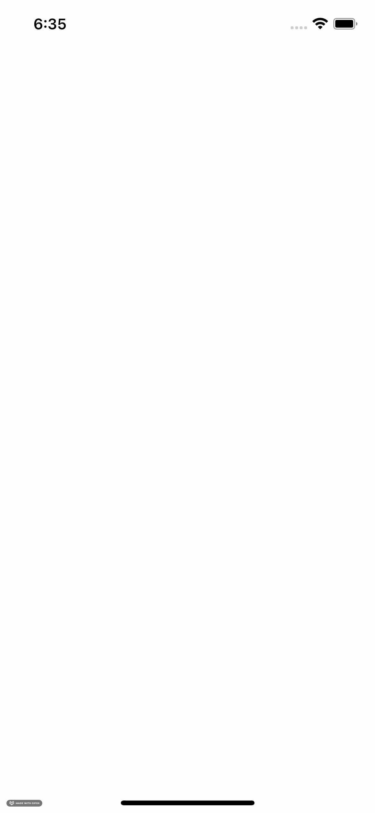

# Light

## Qu'est-ce que c'est ?

Light est une application iOS de lampe torche extrêmement basique. Appuyer sur l'écran change sa couleur du blanc au noir et vice versa. 

## Contexte 

Light est le 1 er projet de [App Development with Swift](https://books.apple.com/us/book/app-development-with-swift/id1465002990) (Apple, 2017), un guide d'apprentissage du développement d'applications iPhone.

Le projet a été développé en suivant globalement les instructions du guide. 

D'un point de vue pédagogique, ce projet entraine entre autres à l'acquisition des éléments suivants : 
- Prise en main de XCode :  Elements de l'interface, Raccourcis clavier...
- Prise en main d'Interface Builder : Storyboard, IBActions, IBOutlet...
- Prise en main des outils d'execution des apps :  Simulateur, Deboggeur, Connexion d'un iDevice...

## Compatibilité 

L'application est optimisée pour iOS 14.

## Captures

